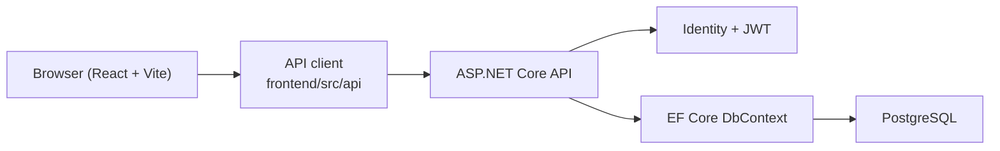

# Architecture Overview

This is the shortest possible mental model of the whole system.

## Big Picture

- React/Vite frontend sends API calls to the ASP.NET backend
- ASP.NET backend uses Identity for login and EF Core for data access
- PostgreSQL stores the persistent data in normal deployments
- seed data makes the app usable immediately after startup

## Frontend Responsibilities

- public pages
- login flow
- role-based routing
- portal tables, detail panels, and admin forms
- user feedback for loading/errors/success states

Main entry points:

- [frontend/src/App.tsx](/Users/lajicpajam/School/Intex II/frontend/src/App.tsx)
- [frontend/src/components/layout/AppShell.tsx](/Users/lajicpajam/School/Intex II/frontend/src/components/layout/AppShell.tsx)
- [frontend/src/contexts/AuthContext.tsx](/Users/lajicpajam/School/Intex II/frontend/src/contexts/AuthContext.tsx)

## Backend Responsibilities

- authentication and authorization
- request validation
- business/data access logic
- seeded demo data
- reporting endpoints

Main entry points:

- [backend/Intex.Api/Program.cs](/Users/lajicpajam/School/Intex II/backend/Intex.Api/Program.cs)
- [backend/Intex.Api/Data/ApplicationDbContext.cs](/Users/lajicpajam/School/Intex II/backend/Intex.Api/Data/ApplicationDbContext.cs)
- [backend/Intex.Api/Controllers/](/Users/lajicpajam/School/Intex II/backend/Intex.Api/Controllers)

## Role Model

- `Admin`
  - can read everything in the portal
  - can create, update, and delete core records
- `Staff`
  - can read operational portal data
  - cannot perform admin-only mutations
- `Donor`
  - can log in
  - can access donor-only history
  - cannot access staff/admin data

## Data Slices

- fundraising:
  - supporters
  - donations
  - allocations
- case management:
  - residents
  - intervention plans
  - process recordings
  - visitations
  - conferences
  - incidents
- reporting/outreach:
  - public impact
  - social posts
  - operational report summaries

## Best Docs To Read Next

- backend details:
  - [docs/backend-walkthrough.md](/Users/lajicpajam/School/Intex II/docs/backend-walkthrough.md)
- frontend details:
  - [docs/frontend-walkthrough.md](/Users/lajicpajam/School/Intex II/docs/frontend-walkthrough.md)
- test/demo checklist:
  - [docs/testing-checklist.md](/Users/lajicpajam/School/Intex II/docs/testing-checklist.md)
